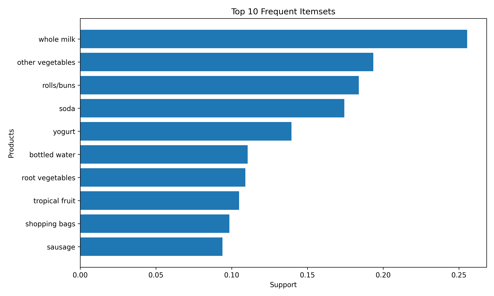
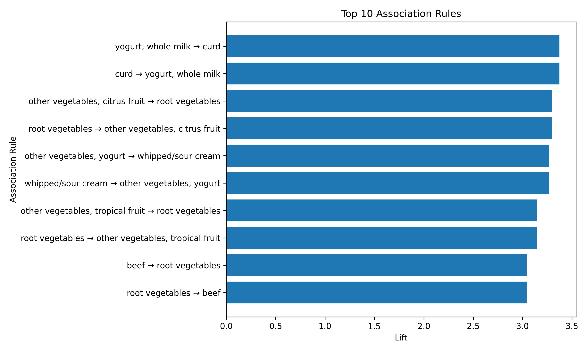

# Market Basket Analysis

**Developed as part of my project with Codec Technologies.**

## Project Overview

This project analyzes customer shopping transactions to find products that are frequently purchased together. The goal is to identify product associations that can help businesses improve cross-selling and product placement.

## Objectives

- Analyze customer transaction data
- Find frequently purchased products
- Discover relationships between products
- Generate association rules
- Visualize frequent itemsets and association rules
- Provide useful business insights

## Technologies Used

- Python
- Pandas
- Matplotlib
- MLxtend
- Apriori Algorithm
- VS Code

## Dataset

The project uses a grocery transaction dataset containing 9,835 customer transactions.

Each transaction contains the products purchased by one customer.

## Methodology

The project follows these steps:

1. Load the grocery transaction data
2. Convert transactions into a suitable format
3. Apply the Apriori algorithm
4. Find frequent itemsets
5. Generate association rules
6. Analyze support, confidence, and lift
7. Visualize the results

## Association Rule Metrics

### Support

Support shows how frequently an item or group of items appears in all transactions.

### Confidence

Confidence shows how often the consequent item is purchased when the antecedent item is purchased.

### Lift

Lift measures how strongly two products are associated compared with their independent occurrence.

A lift value greater than 1 indicates a positive association.

## Visualizations

### Frequent Itemsets



### Association Rules



## Project Structure

```text
market_basket_analysis/
│
├── groceries.csv
├── market_basket.py
├── frequent_itemsets.png
├── association_rules.png
├── association_rules.csv
├── requirements.txt
├── .gitignore
└── README.md

## Business Insights

The association rules provide useful information about products that are frequently purchased together.

- Customers who purchase yogurt and whole milk also show an association with curd. This rule has a lift of 3.37, indicating a strong positive association.
- Customers who purchase other vegetables and citrus fruit show an association with root vegetables. The rule has a confidence of 35.92% and a lift of 3.30.
- Other vegetables and yogurt are associated with whipped/sour cream, with a lift of 3.27.
- Other vegetables and tropical fruit are associated with root vegetables, with a confidence of 34.28% and a lift of 3.14.
- Beef is associated with root vegetables, with a confidence of 33.14% and a lift of 3.04.

These insights can help businesses create product bundles, improve product placement, and provide cross-selling recommendations. For example, products with strong associations can be promoted together or recommended to customers during shopping.

After adding it, save README.md.
